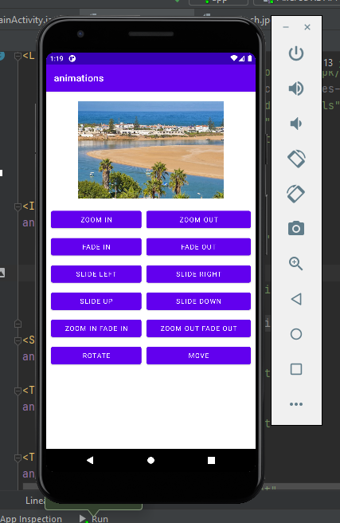

# ANDROID-app-animation

 

  

<h4>the app has 12 buttons :</h4>
 
Zoom in button.
 
Zoom out button.
 
Fade in button.
 
Fade out button. 
 
Slide left button. 
 
Slide right button. 
 
Slide up button.
 
Slide Down button. 
 
Zoom in Fade in button.
 
Zoom out Fade in button. 
 
Rotate button.
 
Move button.
